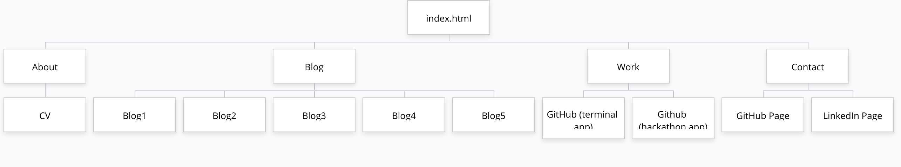
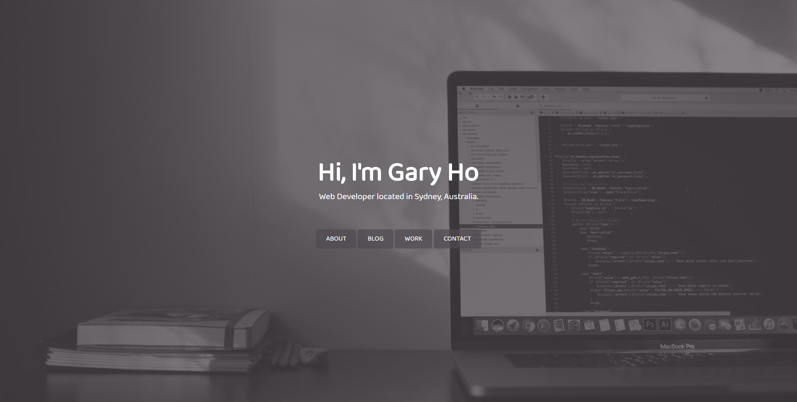
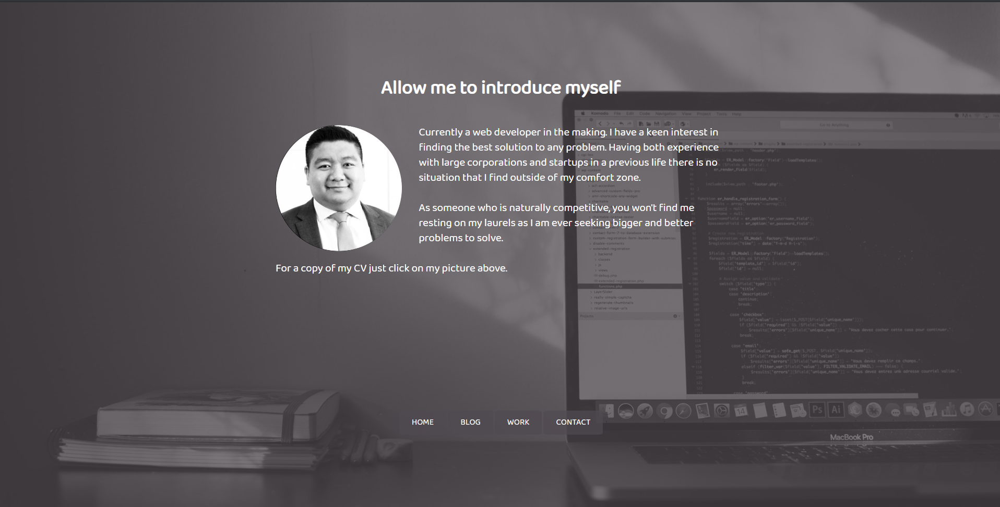
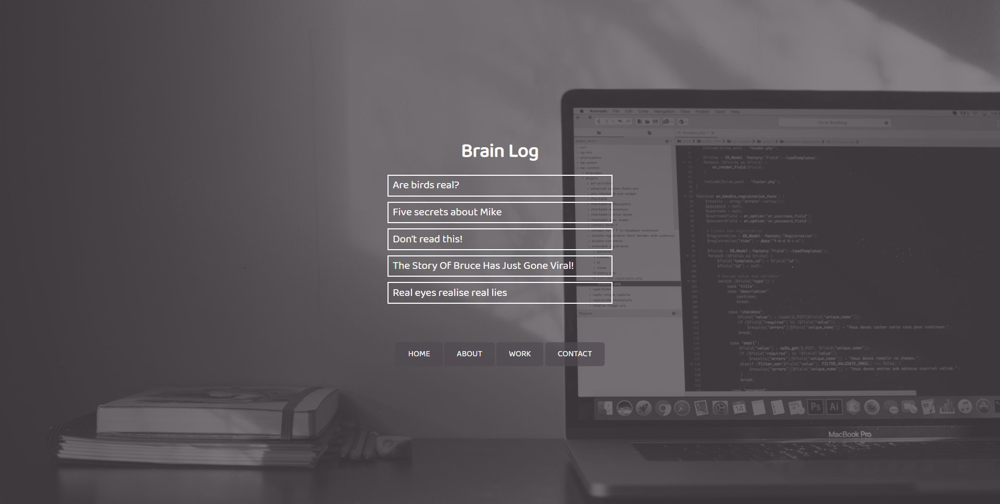
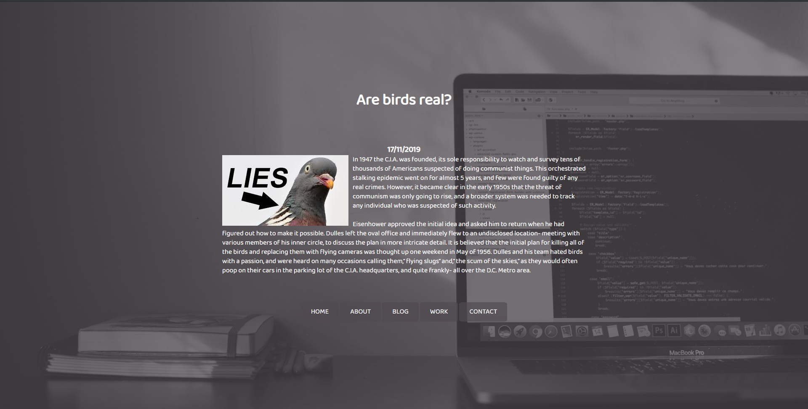
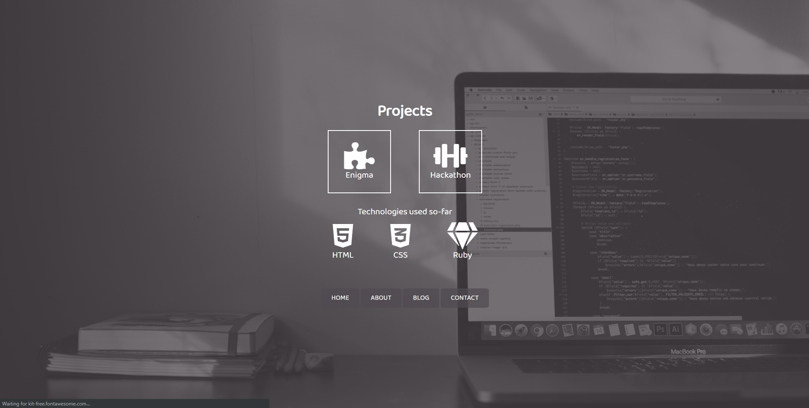

# G-V-H.github.io
website: https://g-v-h.github.io/

github repo: https://github.com/g-v-h/g-v-h.github.io

## Purpose
To create a website that functions as a demonstration and showcase of my professional experience in development that is accessible to all. Furthermore, this website functions as a way to gauge my own comfortability with both HTML and CSS.
## Functionality and Features
### Responsive Web Page Navigation
A key focus was to have a cohesive and unencumbered experience when using the website on both desktop and mobile devices.

Using two different navigation tools for different screen sizes was the solution decided upon.

1. A nav-bar style set of buttons that would statically sit on the page for desktop and large enough mobile devices.
2. A "hamburger" type of navigation bar, which would appear for small enough devices, provided an easy and accessible way to navigate the page without having to try and find the potentially off-screen nav-bar.

### Responsive Web Page Content Design
To enable a better user experience the content of the web pages were designed to fit comfortably for all device users. Through the use of Flexbox the web page content easily scales and transforms to adhere to the dimensions of the user's device.

### Styling and Design
With an emphasis already being on a cohesive experience using the navigation elements it seemed best not only to maintain a consistent styling throughout the website but also have that styling in some part reflect my own brand.

The use of a predominantly grayscale elements with only hints of colour seemed best reflect the image I wanted to portray. Based on traditional colour theory; the use of greys would ideally look to project an air of professionalism/formality , whereas blacks and whites would project sophistication and simplicity respectively. The small flashes of purple were also utilised to show a hint of luxury.

### Subresource Integrity (SRI)
To ensure safer user experiences the use of SRI in the website design in order to prevent unintended changes to third party hosted content.

Using the secure hash algorithm, SHA-2, a hash of the contents is generated to verify against the content delivered upon request. This hash is effectively a unique identifier for the original content intended to be used and any minute singular change to the file will be noticeable and will not parse. 

## Sitemap

## Wireframes
Balsamiq Wireframes 4 was used to make rough sketches of the intended design to use as reference during construction.

Home

About

Blog

Individual blog pages

Work

Contact

## Screenshots
Home

About

Blog

Individual blog pages

Work

Contact

## Target audience
In the long-term, potential employers looking for junior developers. Given the flaws with the design, I do not believe it to be the best showcase of my development career, however, I do see it as a springboard for a redesign.

Ideally, in it's current state, someone with a sense of humour may find it worthwhile or just those looking for some inspiration as I did with other developer's portfolios.

## Tech stack used
* HTML
* CSS
* GitHub Pages for deployment
